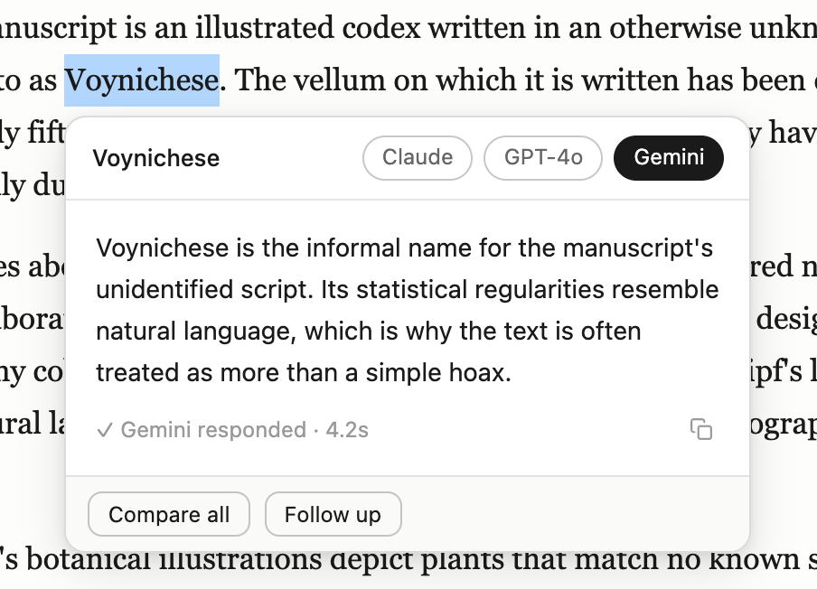
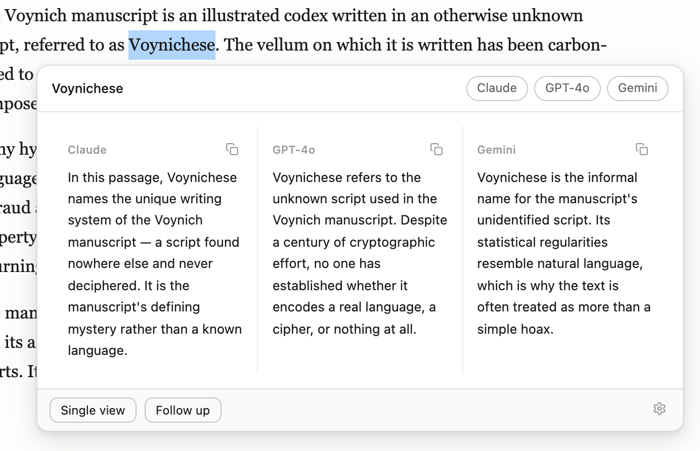
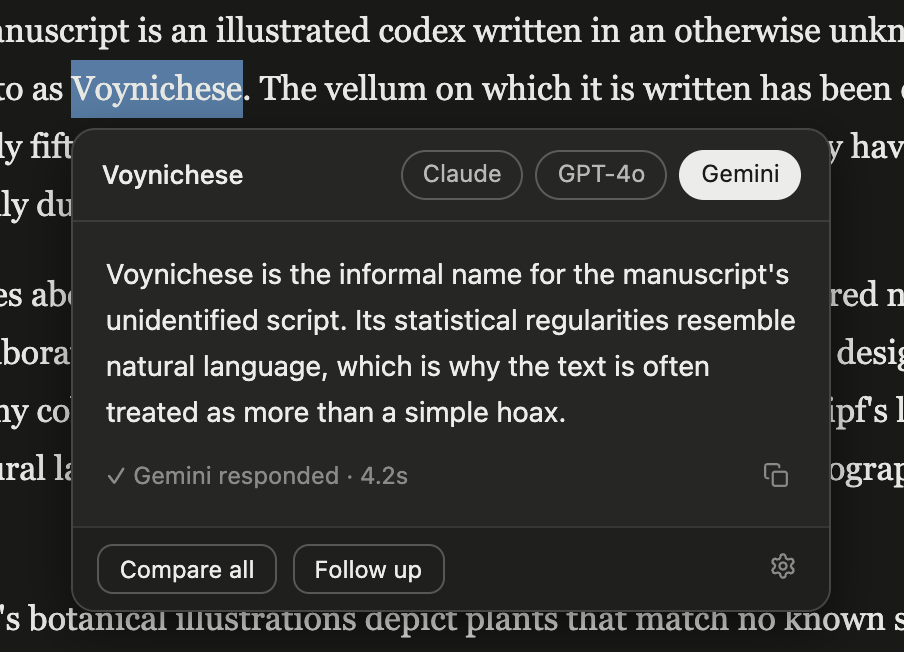
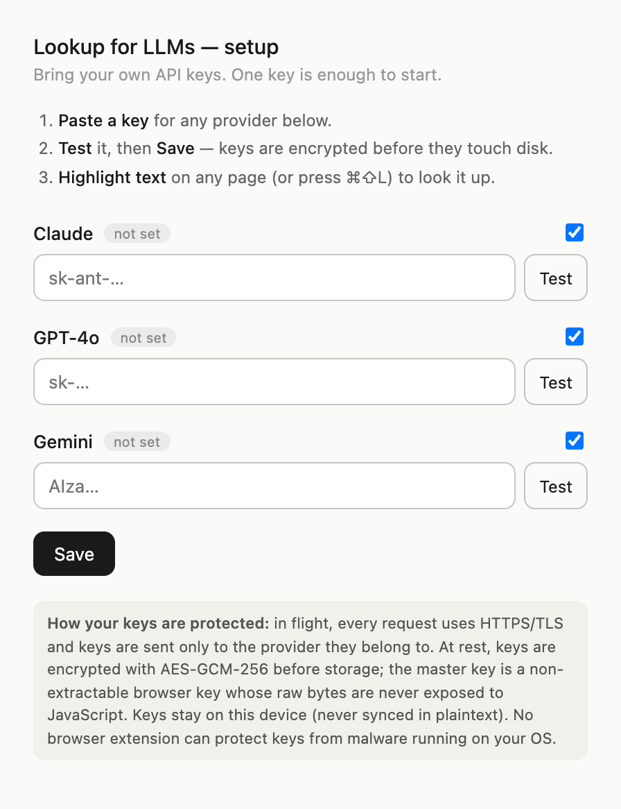

# lumi — Lookup for LLMs

Highlight any text on any page and get instant answers from multiple LLMs — Claude, GPT-4o, and Gemini — in a macOS Lookup-style card, streamed side by side.

<p align="center">
  
</p>

## How it works

1. **Highlight** a word or phrase on any webpage (or press <kbd>⌘⇧L</kbd> / <kbd>Ctrl+Shift+L</kbd> on a selection).
2. A card pops up under your selection and **queries every enabled model in parallel**, streaming tokens live.
3. The **fastest model wins the default tab** — switch models with the pills in the header.

The extension sends your selection *plus its surrounding paragraph* to each model, so answers are disambiguated in context ("explain it *in this passage*"), not generic dictionary definitions.

## Features

### Compare models side by side

Click **Compare all** to see every model's answer in one view:

<p align="center">
  
</p>

### Follow up, copy, dismiss

- **Follow up** — ask a question about the selection; the card becomes a thread: earlier answers stay visible above, the new answer streams in below, and the input stays open for the next question. Switching model pills switches the whole thread.
- **History** — see your past prompts (lookups and follow-up questions). Requires the local proxy server, which saves each prompt to its SQLite database via `POST /v1/prompts`.
- **Copy** — copies the active answer (or all answers in compare view).
- <kbd>Esc</kbd>, scrolling, or clicking outside dismisses the card.

### Dark mode

The card follows your system theme automatically, or force Light/Dark from the settings page (gear icon in the card footer):

<p align="center">
  
</p>

## Installation

### Chrome / Edge / Brave / Arc

*Chrome Web Store listing coming soon.* Until then, install from a release zip:

1. Download `lumi-chrome-vX.Y.Z.zip` from the [latest release](https://github.com/Yi-99/lumi/releases/latest) and unzip it (or clone this repo and use the `extension/` folder directly).
2. Open `chrome://extensions` (or `edge://extensions`).
3. Enable **Developer mode** (top right).
4. Click **Load unpacked** and select the unzipped folder.

### Firefox

*addons.mozilla.org listing coming soon.* Release Firefox only permanently installs signed add-ons, so until the AMO listing is live you can load it temporarily:

1. Download `lumi-firefox-vX.Y.Z.zip` from the [latest release](https://github.com/Yi-99/lumi/releases/latest).
2. Open `about:debugging#/runtime/this-firefox`.
3. Click **Load Temporary Add-on…** and pick the zip (removed when Firefox restarts).

## Setup — bring your own API keys

Click the extension icon (or open its options page) and paste a key for at least one provider:

<p align="center">
  
</p>

| Provider | Key looks like | Get a key |
|---|---|---|
| Claude (`claude-sonnet-4-6`) | `sk-ant-…` | [console.anthropic.com](https://console.anthropic.com/) |
| GPT-4o (`gpt-4o-mini`) | `sk-…` | [platform.openai.com](https://platform.openai.com/api-keys) |
| Gemini (`gemini-2.0-flash`) | `AIza…` | [aistudio.google.com](https://aistudio.google.com/apikey) |

The settings page also shows **per-provider token usage** (input/output tokens and lookup count, parsed from each provider's own streaming usage reports) with a reset button — so you can see what each key is costing you.

Untick a provider's checkbox to disable it without deleting the key. Keys are encrypted at rest with AES-GCM-256 (non-extractable WebCrypto master key, see [extension/vault.js](extension/vault.js)), stay on this device, and are sent **only** to each provider's official API endpoint — or, if you enable it, through the optional local proxy below.

## Optional local proxy server

A dockerized FastAPI backend in [backend/](backend/) can handle the provider fan-out server-side. It's optional — the extension calls providers directly when no proxy is configured, and silently falls back to direct mode if the server is down.

```sh
docker compose up --build     # or: task server
# port 8000 taken? → LUMI_PORT=8010 docker compose up --build
```

Then set **Local proxy server** to `http://localhost:8000` (or your chosen port) in the extension settings.

- One `POST /v1/lookup` request; the server queries all providers concurrently (asyncio + httpx) and streams a single merged SSE response whose events are exactly the extension's internal message format.
- **Fully standalone** — the server runs on *your* machine; there is no cloud component and nothing anyone else maintains.
- Dev-grade only: per-IP rate limiting (30 req/min), no auth. Don't expose it beyond localhost without adding authentication (there's a placeholder dependency slot in [backend/app/main.py](backend/app/main.py)).

### Server-side key storage (optional)

Instead of clients sending keys with every request, you can store them once in the server's local SQLite database (a docker volume on your machine — same trust model as `~/.aws/credentials`, chmod 0600, never leaves the box):

```sh
curl -X PUT localhost:8000/v1/keys -H 'content-type: application/json' \
  -d '{"claude": "sk-ant-…", "gemini": "AIza…"}'
curl localhost:8000/v1/keys              # status only — never returns key material
curl -X DELETE localhost:8000/v1/keys/claude
```

Lookup requests resolve keys as: `X-*-Key` headers first, stored keys as fallback. Lookups never write to the store, and error messages never include key material.

### Prompt history

When a proxy is configured, the extension saves each prompt (the highlighted selection and any follow-up question — not the answers) to the same local SQLite database, and the card's **History** button lists them:

```sh
curl localhost:8000/v1/prompts           # newest first, ?limit=1..200
curl -X DELETE localhost:8000/v1/prompts # clear history
```

The server is managed with [uv](https://docs.astral.sh/uv/) (`pyproject.toml` + `uv.lock`); the Docker build uses `uv sync --frozen`, so installs are reproducible.

## Usage tips

- Selections of **2–120 characters** trigger the card on mouse-release; longer selections (up to 400 chars) only trigger via the keyboard shortcut, so drag-selecting paragraphs while reading doesn't spam popups.
- Change the shortcut at `chrome://extensions/shortcuts`.

## Development

No build step — plain JavaScript (Manifest V3) plus an optional Python backend.

```
lumi/
├── extension/       # the browser extension — "Load unpacked" points here
├── frontend/        # marketing/landing website (React + Vite)
└── backend/         # optional FastAPI proxy (dockerized)
```

| File | Role |
|---|---|
| [extension/content.js](extension/content.js) | Selection detection + the card UI (rendered in a shadow DOM so page CSS can't touch it) |
| [extension/background.js](extension/background.js) | MV3 service worker: fans out to providers (directly or via the proxy), parses SSE, relays chunks over a `Port` |
| [extension/vault.js](extension/vault.js) | AES-GCM-256 encrypted key storage |
| [extension/options.html](extension/options.html) / [extension/options.js](extension/options.js) | Setup workflow (keys, per-provider toggles, proxy URL) |
| [extension/preview.html](extension/preview.html) | UI preview harness — open it directly in a browser; `chrome.*` is stubbed and responses are fake streams, so you can iterate on the card without loading the extension or spending tokens |
| [backend/app/main.py](backend/app/main.py) | FastAPI app: `/v1/lookup` SSE fan-out, rate limiting, CORS |
| [backend/app/providers.py](backend/app/providers.py) | httpx streaming adapters for the three provider APIs |

To try the UI without any API keys: open [extension/preview.html](extension/preview.html) in a browser and highlight any word on the page.

With [Task](https://taskfile.dev) installed, one command serves the harness on localhost and opens it in a Playwright-controlled browser:

```sh
task preview
```

The first run downloads Playwright's Chromium build (`task setup` runs automatically). Close the browser window to stop the server.

### Building release zips

```sh
task build        # or: bash scripts/build.sh
```

Produces `dist/lumi-chrome-vX.Y.Z.zip` (Chrome Web Store / Edge Add-ons) and `dist/lumi-firefox-vX.Y.Z.zip` (AMO) from the shared source in `extension/`. The Chrome manifest is the source of truth; the Firefox manifest is derived at build time (background event page instead of service worker, plus the gecko id). Needs `jq`, `zip`, and `rsync`.

### Releasing

1. Bump `version` in [extension/manifest.json](extension/manifest.json).
2. Tag and push: `git tag vX.Y.Z && git push origin vX.Y.Z`.
3. The [release workflow](.github/workflows/release.yml) builds both zips, lints the Firefox build with `web-ext`, and attaches them to a GitHub Release. Store submissions (Chrome Web Store, AMO) are manual.

### Icons

`extension/icons/lumi.svg` is the icon source; the PNGs are pre-rendered and checked in. To regenerate after editing the SVG:

```sh
rsvg-convert -w 1024 -h 1024 extension/icons/lumi.svg -o /tmp/lumi-1024.png
for N in 16 32 48 128; do sips -z $N $N /tmp/lumi-1024.png --out extension/icons/lumi-$N.png; done
```

(Any SVG rasterizer works — `qlmanage -t -s 1024` on macOS, Inkscape, etc.)

## License

[MIT](LICENSE)
